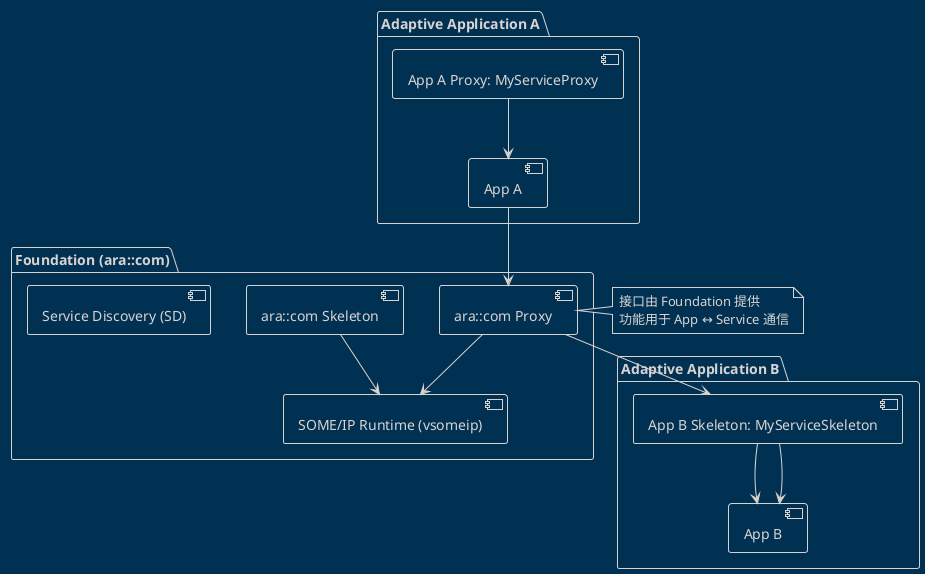
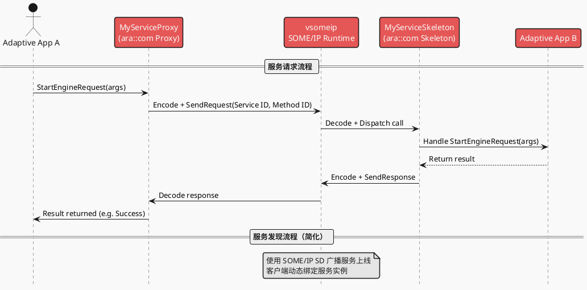
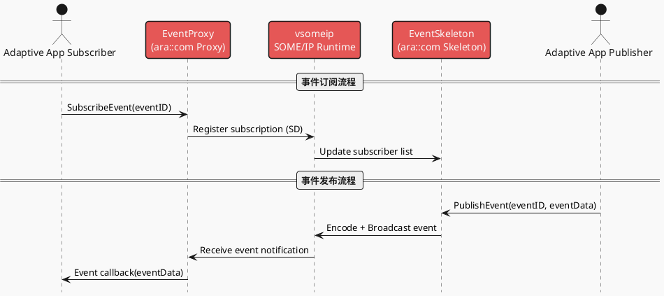

```plantuml
@startuml
!theme blueprint

package "Adaptive Application A" {
  [App A]
  [App A Proxy: MyServiceProxy] --> [App A]
}

package "Foundation (ara::com)" {
  [ara::com Proxy]
  [ara::com Skeleton]
  [SOME/IP Runtime (vsomeip)]
  [Service Discovery (SD)]
  [ara::com Proxy] --> [SOME/IP Runtime (vsomeip)]
  [ara::com Skeleton] --> [SOME/IP Runtime (vsomeip)]
}

package "Adaptive Application B" {
  [App B]
  [App B Skeleton: MyServiceSkeleton] --> [App B]
}

[App A] --> [ara::com Proxy]
[ara::com Proxy] --> [App B Skeleton: MyServiceSkeleton]
[App B Skeleton: MyServiceSkeleton] --> [App B]

note right of [ara::com Proxy]
  接口由 Foundation 提供
  功能用于 App ↔ Service 通信
end note

@enduml

```

```plantuml
@startuml
!theme mars
hide footbox

actor "Adaptive App A" as ClientApp
participant "MyServiceProxy\n(ara::com Proxy)" as Proxy
participant "vsomeip\nSOME/IP Runtime" as Transport
participant "MyServiceSkeleton\n(ara::com Skeleton)" as Skeleton
participant "Adaptive App B" as ServerApp

== 服务请求流程 ==

ClientApp -> Proxy : StartEngineRequest(args)
Proxy -> Transport : Encode + SendRequest(Service ID, Method ID)
Transport -> Skeleton : Decode + Dispatch call

Skeleton -> ServerApp : Handle StartEngineRequest(args)
ServerApp --> Skeleton : Return result

Skeleton -> Transport : Encode + SendResponse
Transport -> Proxy : Decode response
Proxy -> ClientApp : Result returned (e.g. Success)

== 服务发现流程（简化） ==

note over Transport
    使用 SOME/IP SD 广播服务上线
    客户端动态绑定服务实例
end note

@enduml

```

```plantuml
@startuml
!theme mars
hide footbox

actor "Adaptive App Subscriber" as Subscriber
participant "EventProxy\n(ara::com Proxy)" as Proxy
participant "vsomeip\nSOME/IP Runtime" as Transport
participant "EventSkeleton\n(ara::com Skeleton)" as Skeleton
actor "Adaptive App Publisher" as Publisher

== 事件订阅流程 ==

Subscriber -> Proxy : SubscribeEvent(eventID)
Proxy -> Transport : Register subscription (SD)
Transport -> Skeleton : Update subscriber list

== 事件发布流程 ==

Publisher -> Skeleton : PublishEvent(eventID, eventData)
Skeleton -> Transport : Encode + Broadcast event
Transport -> Proxy : Receive event notification
Proxy -> Subscriber : Event callback(eventData)

@enduml

```
